# AllPartyRent Application Architecture

## System Overview

```mermaid
graph TB
    %% User Types
    Client[👤 Client User]
    Provider[🏢 Provider User]
    Admin[👑 Admin User]
    
    %% Core Application
    NextJS[🚀 Next.js App]
    Auth[🔐 NextAuth.js]
    DB[(🗄️ PostgreSQL Database)]
    PayPal[💳 PayPal API]
    
    %% Main User Flows
    Client --> NextJS
    Provider --> NextJS
    Admin --> NextJS
    NextJS --> Auth
    NextJS --> DB
    NextJS --> PayPal
```

## Database Schema & Relationships

## User Journey Flow

## Payment Processing Flow

## Service Booking Process

## System Architecture Components

## Key Features & Capabilities

### For Clients:
- Browse and search services by category/location
- Book services with calendar scheduling
- Secure PayPal payment processing
- Real-time booking status updates
- Service provider communication

### For Providers:
- PayPal merchant onboarding
- Service catalog management
- Booking request management
- Payment tracking and history
- Business profile management

### For Admins:
- User and provider management
- Transaction monitoring
- System settings and configuration
- Platform analytics

### Technical Features:
- Automatic transaction processing with escrow
- Background job processing for payments
- Real-time notifications
- Responsive design with Chakra UI
- Type-safe database operations with Prisma
- Secure authentication with NextAuth.js 